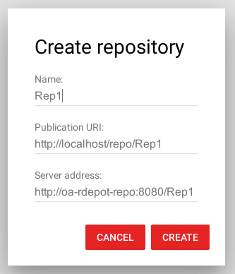
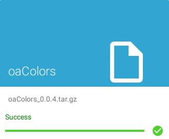

# RDepot

Containerized version of [RDepot](https://www.rdepot.io).

RDepot is a solution for the management of R package repositories in an enterprise environment. It allows to submit packages through a user interface or API and to automatically update and publish R repositories. Multiple departments can manage their own repositories and different users can have different roles in the management of their packages.

## Installation

1. Clone the RDepot repository and go to its directory
2. Launch RDepot using the following command:
```
docker-compose up
```

## Logging in
Once the RDepot is launched, you can open your browser and go to
```
http://localhost
```
You will be asked to log in. Default administrator credentials:
```
Username: einstein
Password: password
```

## Setting up internal CRAN repository

Go to "Repositories" section and click the blue button at the bottom-right.
You will see a "Create Repository" dialog. Fill the blanks as follows and click on "CREATE" button:




You can publish your repository and upload the first package!

## Uploading a package

1. Go to "Upload packages" section  
2. Click the blue button at the bottom-right  
3. Select the following file:
```
./examples/oaColors_0.0.4.tar.gz
```
4. Click on the field below the "Upload" button and choose "Rep1" repository.
5. Click the "Upload" button.



## Installing the package

Once you uploaded your first package, you can try to install it.  
1. Go to "repositories" section and click on "Rep1" repository.  
2. Click on the oaColors package.  
3. You can install your package by following the instructions or download it by clicking on the link at the bottom of the page.

#### Copyright (c) Copyright of Open Analytics NV, 2016-2019 - Apache 2.0 License
